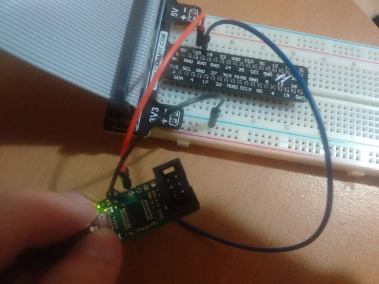

# Raspberry Pi Setup Guide
Without Display and Wired Lan (Ethernet)

## Note
* Do not forget reboot (pi$> sudo reboot) to reflect changes
* I assume the IP address of Raspberry Pi is 192.168.0.144
## First step
* You will be able to:
	* Login to Raspberry Pi via UART
* You need:
	* Raspberry Pi
	* USB-Serial converter
	* SD card
	* Windows PC
* You do not need:
	* Wired Lan (Ethernet)
	* Display
	* Keyboard/mouse for Raspberry Pi

### Install Raspbian
### Install Raspbian with NOOBS
I don't use this

### Install Raspbian Directly
* Download OS image
	* https://www.raspberrypi.org/
	* DOWNLOADS -> RASPBIAN -> Raspbian Jessie -> Download ZIP
* Download Win32DiskImager
	* https://sourceforge.net/projects/win32diskimager/
* Write OS image
	* Run Win32DiskImager as administrator
	* Select unzipped os image file and SD card drive
	* Click "Write"

### Connect to Raspberry Pi via UART
* Connect USB-Serial converter to Windows PC
* Connect TX(Raspberry Pi) to RX(PC), RX(Raspberry Pi) to TX(PC), and GND
* Run terminal application (e.g. Tera Term)
* Select Serial, and set baudrate as 115200


### Login to Raspberry Pi
* Insert SD card OS image is written in
* Connect USB power cable
* You will see login prompt in your terminal
* Login as
	* User ID: pi
	* Password: raspberry


## Second step
* You will be able to:
	* Login to Raspberry Pi via SSH with WiFi
* You need:
	* WiFi dongle

### Turn on Raspberry Pi
* Connect the WiFi dongle into Raspberry Pi
* Turn on Raspberrypi and login

### Modify Wifi configuration
* pi$> sudo nano /etc/wpa_supplicant/wpa_supplicant.conf
```
ctrl_interface=DIR=/var/run/wpa_supplicant GROUP=netdev
update_config=1
country=GB

network={
        ssid="hoge"
        psk="hogehogehoge"
        key_mgmt=WPA-PSK
}
```

* pi$> sudo nano /etc/network/interfaces
```
source-directory /etc/network/interfaces.d

auto lo
iface lo inet loopback
iface eth0 inet manual

auto wlan0
allow-hotplug wlan0
#iface wlan0 inet manual
iface wlan0 inet static
address 192.168.0.144
netmask 255.255.255.0
gateway 192.168.0.1

wpa-conf /etc/wpa_supplicant/wpa_supplicant.conf

iface default inet dhcp
```

* pi$> sudo iwconfig wlan0 power off

### Enable SSH
* pi$> sudo raspi-config
	* 9 Advanced Options -> A4 SSH -> Enable
* pi$> sudo reboot
### Note:
* You may be asked if you want to add the device to known host list. just click OK
* It may take some time to connect at first

## [Optional] USB memory
* You will be able to:
	* Use your USB stick memory as OS root. It is said that it's more reliable than SD card.
* You need:
	* USB stick memory
### how to
 Skip

## [Optional] Setup HDMI Display (1080 x 600)
* You will be able to:
	* Use a 7 inch display with resolution of 1080 x 600
* You need:
	* display (1080 x 600)
		* http://www.waveshare.com/wiki/7inch_HDMI_LCD_%28C%29
	* HDMI cable

### Modify Config file
* pi$> sudo nano /boot/config.txt
* pi$> sudo reboot
```
max_usb_current=1
hdmi_group=2
hdmi_mode=1
hdmi_mode=87
hdmi_cvt 1024 600 60 6 0 0 0
```
[Completed config.txt is here](display/config.txt)


## Transfer files on sftp
* You will be able to:
	* Transfer(upload/download) files to/from Raspberry Pi
* You need:
	* SFTP Client. I use sftp command and msys here

### Connect to Raspberry Pi via SFTP (PC side)
* $PC$ > sftp pi@192.168.0.144

### Commands
* sftp> cd hoge
* sftp> lcd fuga
* sftp> get /boot/config.txt
* sftp> get -r Desktop/
* sftp> put test.txt
* sftp> quit
* others: lmkdir, lls

## Remote Desktop using VNC
* You will be able to:
	* Access Raspberry Pi using Remote Desktop (GUI)
### Install VNC Client on Host PC
https://www.realvnc.com/download/

### Install VNC Server on Raspberry Pi
```
pi$> sudo apt-get update
pi$> sudo apt-get upgrade
pi$> sudo apt-get install tightvncserver
pi$> tightvncserver
	New 'X' desktop is raspberrypi:1
pi$> vncserver :1 -geometry 800x600 -depth 24
```
### Confirm connection
* Connect to the Raspberry Pi using VNC Client
	* VNC Server: 192.168.0.144:1
	* Encryption: Let VNC Server choose

### Stop VNC server
```
pi$> vncserver -kill :1
```

### Autostart setting
```
pi$> sudo vi /etc/init.d/vncboot
pi$> sudo chmod 755 /etc/init.d/vncboot
pi$> sudo update-rc.d vncboot defaults
pi$> sudo reboot
```
[Completed vncboot is here](vnc/vncboot) (Retrieved from http://assimane.blog.so-net.ne.jp/2013-03-27)

### Disable autostart
```
pi$> sudo update-rc.d vncboot remove
```

### Confirmations
#### VNC Running?
```
pi$> ps -ef | grep vnc
pi$> netstat -nlt
```
5901 port should be open

#### Added autostart servie?
```
pi$> ls /etc/rc*.d
pi$> service vncboot status
```
